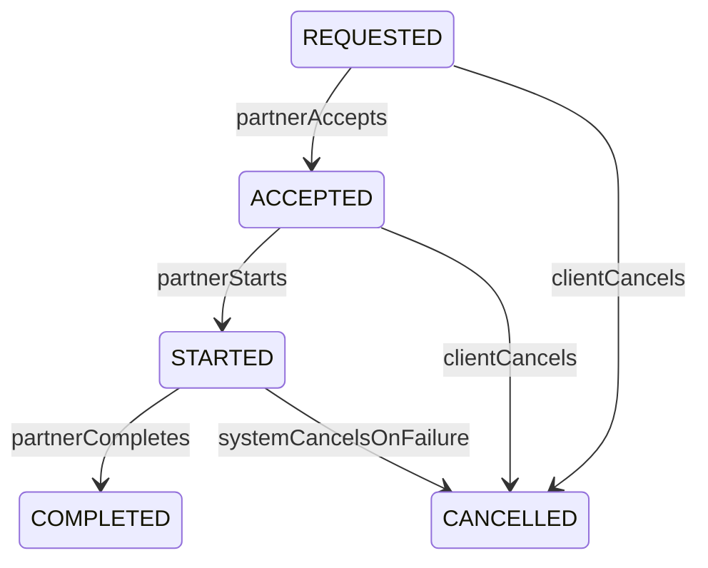

## Ciclo de vida de servicios de telepresencia

Este documento resume el **ciclo de vida de un servicio de telepresencia**, los **endpoints REST** expuestos por `backend-management-service` y **cómo usarlos desde frontend**. Las **estructuras tipo Postman** (método, URL, headers, body) están en la **sección 7**.

Todos los endpoints descritos aquí viven bajo el prefijo:

- Base URL backend (ejemplo local): `http://localhost:8080`
- Base path módulo: `/api/services`

Por simplicidad en los ejemplos, se usará:

- `BASE = http://localhost:8080/api/services` (ajusta host/puerto según tu entorno)

Autenticación: los endpoints usan **JWT de Keycloak**, y el backend obtiene el `keycloakId` del `sub` del token para mapearlo a entidades `Client` y `Partner`.

### Por qué se quitó `clientId` del body al crear servicio (`POST /create`)

Antes el cliente podía enviar un `clientId` en el JSON. Eso presentaba problemas de **seguridad y consistencia**:

1. **Suplantación**: un usuario autenticado como cliente A podría, en teoría, enviar `clientId` de otro cliente B y crear servicios a nombre de B si el backend confiaba en el body.
2. **Fuente de verdad única**: el JWT ya identifica al usuario (vía Keycloak `sub` → fila en `clients`). El **dueño del servicio** debe ser siempre ese usuario, no un campo editable por el cliente.
3. **Menos errores en frontend**: no hace falta sincronizar “id del usuario logueado” con un campo del formulario; el backend resuelve el cliente automáticamente.

Por eso el **identificador del cliente no va en el body**: se obtiene del token. El `clientId` **sí aparece en la respuesta** (`ServiceResponse`) como dato de lectura, no como entrada al crear.

---

## 1. Estados del servicio

Los servicios se modelan con el enum `ServiceStatus` y se exponen como `String status` en `ServiceResponse`.

Estados relevantes:

| Estado       | Quién lo provoca                           | Descripción breve                                                                 |
|-------------|---------------------------------------------|-----------------------------------------------------------------------------------|
| `REQUESTED` | Cliente (`/create`)                         | Servicio recién solicitado, visible para socios disponibles de la misma área.    |
| `ACCEPTED`  | Socio (`/{id}/accept`)                      | Un socio disponible toma la solicitud; queda bloqueada para otros socios.        |
| `STARTED`   | Socio (`/{id}/start`)                       | La sesión de telepresencia ha iniciado efectivamente.                            |
| `COMPLETED` | Socio (`/{id}/complete`)                    | Servicio finalizado exitosamente.                                                |
| `CANCELLED` | Cliente (`/{id}/cancel`) o sistema interno  | Servicio cancelado antes / durante la ejecución según reglas de negocio.         |

Campos de tiempo en `ServiceResponse`:

- `requestedAt`: momento en el que el cliente crea la solicitud (`REQUESTED`).
- `acceptedAt`: momento en el que un socio acepta el servicio (`ACCEPTED`).
- `startedAt`: momento de inicio efectivo del servicio (`STARTED`).
- `endedAt`: momento de finalización (`COMPLETED` o `CANCELLED`).

---

## 2. Modelo de respuesta: `ServiceResponse`

Todos los endpoints que operan sobre un servicio devuelven el mismo contrato JSON:

```json
{
  "serviceId": 123,
  "clientId": 10,
  "partnerId": 42,
  "areaId": 5,
  "startLocationDescription": "Plaza central, punto de encuentro",
  "agreedHours": 2,
  "hourlyRate": 15.50,
  "status": "ACCEPTED",
  "requestedAt": "2026-04-01T10:00:00",
  "acceptedAt": "2026-04-01T10:05:00",
  "startedAt": null,
  "endedAt": null
}
```

Notas para frontend:

- `status` siempre es un `String` con uno de los valores de la tabla anterior.
- Los timestamps pueden venir en `null` si el evento aún no ha ocurrido (por ejemplo, `acceptedAt` en `REQUESTED`).
- Para refrescar un servicio puntual, usar `GET /api/services/{serviceId}`.

---

## 3. Endpoints clave

### 3.1. Crear servicio (CLIENT)

- **Método**: `POST`
- **Path**: `/api/services/create`
- **Rol requerido**: `CLIENT`
- **Descripción**: crea una nueva solicitud de servicio en estado `REQUESTED`.
- **Identidad del cliente**: se toma **solo del JWT** (no se envía `clientId` en el body).
- **Header opcional**: `X-Idempotency-Key` (máx. 128 caracteres). Repetir la misma clave para el mismo cliente devuelve el **mismo** servicio creado la primera vez.
- **Regla anti-duplicado**: no se permite crear otro servicio activo (`REQUESTED`, `ACCEPTED`, `STARTED`) mientras exista uno; responde `409` con mensaje de negocio.

**Request body (ejemplo orientativo)**:

```json
{
  "areaId": 5,
  "startLocationDescription": "Plaza central",
  "agreedHours": 2,
  "hourlyRate": 15.50
}
```

**Response**:

- `201 CREATED`
- Cuerpo: `ServiceResponse` con `status = "REQUESTED"` y `requestedAt` lleno.

**Postman**: headers y body listos para copiar en la **sección 7.1**.

---

### 3.2. Listar servicios de un cliente (CLIENT)

- **Método**: `GET`
- **Path**: `/api/services/client/{clientId}`
- **Rol requerido**: `CLIENT`
- **Descripción**: devuelve todos los servicios de un cliente, en cualquier estado.
- **Autorización**: `{clientId}` debe coincidir con el id del cliente autenticado; si no, `403`.

**Response**:

- `200 OK`
- Cuerpo: `ServiceResponse[]`

---

### 3.3. Listar servicios de un socio (PARTNER)

- **Método**: `GET`
- **Path**: `/api/services/partner/{partnerId}`
- **Rol requerido**: `PARTNER`
- **Descripción**: lista todos los servicios asignados a un socio.
- **Autorización**: `{partnerId}` debe coincidir con el id del socio autenticado; si no, `403`.

**Response**:

- `200 OK`
- Cuerpo: `ServiceResponse[]`

---

### 3.4. Listar servicios disponibles para aceptar (PARTNER)

- **Método**: `GET`
- **Path**: `/api/services/available/{areaId}`
- **Rol requerido**: `PARTNER`
- **Descripción**: lista servicios en `REQUESTED` para un área concreta, visibles para socios disponibles.

**Response**:

- `200 OK`
- Cuerpo: `ServiceResponse[]` (solo con `status = "REQUESTED"`).

---

### 3.5. Obtener un servicio por id (CLIENT o PARTNER)

- **Método**: `GET`
- **Path**: `/api/services/{serviceId}`
- **Roles permitidos**: `CLIENT`, `PARTNER`
- **Descripción**: recuperar el estado más reciente y timestamps de un servicio.
- **Autorización**:
  - **CLIENT**: solo si el servicio pertenece a ese cliente.
  - **PARTNER**: si está asignado al socio, o si el servicio está en `REQUESTED` y el área coincide con el área del socio (para inspección antes de aceptar).
- Si no tiene permiso: `403 FORBIDDEN` (o mensaje equivalente).

**Response**:

- `200 OK` con `ServiceResponse` si existe.
- `404 NOT_FOUND` si el id no existe.

---

### 3.6. Aceptar servicio (PARTNER)

- **Método**: `POST`
- **Path**: `/api/services/{serviceId}/accept`
- **Rol requerido**: `PARTNER`
- **Precondiciones de estado**:
  - El servicio debe estar en `REQUESTED`.
  - El socio debe estar disponible y no tener otros servicios en `ACCEPTED` o `STARTED`.
- **Postcondiciones**:
  - `status` pasa a `ACCEPTED`.
  - Se asigna el socio, se llena `acceptedAt` y se registra en el historial.

**Response**:

- `200 OK` con `ServiceResponse` actualizado.
- `404 NOT_FOUND` si el servicio o el socio no existen.
- `409 CONFLICT` (`BusinessRuleViolationException`) si las reglas de negocio no se cumplen, por ejemplo:
  - Servicio no está en `REQUESTED`.
  - El socio ya tiene un servicio activo.
  - El socio no está disponible.

---

### 3.7. Iniciar servicio (PARTNER)

- **Método**: `POST`
- **Path**: `/api/services/{serviceId}/start`
- **Rol requerido**: `PARTNER`
- **Precondiciones de estado**:
  - El servicio debe estar en `ACCEPTED`.
  - El socio autenticado debe ser el mismo que aceptó el servicio.
- **Postcondiciones**:
  - `status` pasa a `STARTED`.
  - `startedAt` se establece a la hora actual.

**Response**:

- `200 OK` con `ServiceResponse` actualizado.
- `404 NOT_FOUND` si el servicio no existe.
- `409 CONFLICT` si:
  - El servicio no está en `ACCEPTED`.
  - El servicio no está asignado al socio autenticado.

---

### 3.8. Completar servicio (PARTNER)

- **Método**: `POST`
- **Path**: `/api/services/{serviceId}/complete`
- **Rol requerido**: `PARTNER`
- **Precondiciones de estado**:
  - El servicio debe estar en `STARTED`.
  - El socio autenticado debe ser el mismo que está asignado al servicio.
- **Postcondiciones**:
  - `status` pasa a `COMPLETED`.
  - `endedAt` se establece.
  - Si el socio estaba `busy`, su disponibilidad vuelve a `available`.

**Response**:

- `200 OK` con `ServiceResponse` actualizado.
- `404 NOT_FOUND` si el servicio no existe.
- `409 CONFLICT` si:
  - El servicio no está en `STARTED`.
  - El socio autenticado no coincide con el asignado.

---

### 3.9. Cancelar servicio (CLIENT)

- **Método**: `POST`
- **Path**: `/api/services/{serviceId}/cancel`
- **Rol requerido**: `CLIENT`
- **Precondiciones de estado**:
  - El servicio debe pertenecer al cliente autenticado.
  - No puede estar en `COMPLETED` ni `CANCELLED`.
  - Si está en `STARTED`, **no** se cancela desde este endpoint (solo cancelación automática del sistema por fallos de conexión).
  - Estados cancelables explícitos: `REQUESTED`, `ACCEPTED`.
- **Postcondiciones**:
  - Se cancela la pre-autorización de pago asociada.
  - Si había socio asignado y estaba `busy`, se marca `available`.
  - `status` pasa a `CANCELLED`, se fija `endedAt` y se limpia la referencia al socio.

**Response**:

- `200 OK` con `ServiceResponse` actualizado.
- `404 NOT_FOUND` si el servicio o el cliente no existen.
- `409 CONFLICT` en casos como:
  - El cliente no es el dueño del servicio.
  - El servicio ya está `COMPLETED` o `CANCELLED`.
  - El servicio está en `STARTED` (solo cancelable por sistema).
  - El servicio no está en un estado cancelable.

---

### 3.10. Cancelar servicio por socio (PARTNER)

- **Método**: `POST`
- **Path**: `/api/services/{serviceId}/cancel/by-partner`
- **Rol requerido**: `PARTNER`
- **Precondiciones**: servicio en `ACCEPTED`, asignado al socio autenticado; no aplica a `STARTED` desde este endpoint.
- **Response**: `200 OK` con `ServiceResponse`; errores de negocio → `409`.

---

## 4. Notas de concurrencia y restricciones

- Un socio **no puede** tener más de un servicio en estados activos (`ACCEPTED`, `STARTED`).
- Una vez que un servicio está en `ACCEPTED`, deja de estar disponible en el listado `/available/{areaId}` para otros socios.
- Un servicio en `CANCELLED` o `COMPLETED` es terminal: no cambia a otros estados.

---

## 5. Flujos típicos frontend

### 5.1. Flujo cliente: creación y cancelación previa al inicio

1. El cliente crea un servicio:
   - `POST BASE/create` → recibe `status = "REQUESTED"`.
2. El cliente revisa su historial o lista:
   - `GET BASE/client/{clientId}` para listar todos.
3. Si decide cancelar antes de que inicie:
   - `POST BASE/{serviceId}/cancel`.
4. Frontend refresca:
   - `GET BASE/{serviceId}` → `status = "CANCELLED"`, `endedAt` lleno.

### 5.2. Flujo socio: aceptar, iniciar y completar

1. El socio (disponible) descubre servicios:
   - `GET BASE/available/{areaId}` → lista con `status = "REQUESTED"`.
2. Acepta un servicio:
   - `POST BASE/{serviceId}/accept` → `status = "ACCEPTED"`, `acceptedAt` lleno.
3. Al iniciar la sesión:
   - `POST BASE/{serviceId}/start` → `status = "STARTED"`, `startedAt` lleno.
4. Al finalizar:
   - `POST BASE/{serviceId}/complete` → `status = "COMPLETED"`, `endedAt` lleno, socio vuelve a disponible.

En cualquier paso, tanto cliente como socio pueden usar:

- `GET BASE/{serviceId}` para refrescar el servicio,
- o `GET BASE/client/{clientId}` / `GET BASE/partner/{partnerId}` para listas.

---

## 6. Diagrama de estados (Mermaid)



Este diagrama resume las transiciones aceptadas por el backend y puede utilizarse para modelar la lógica de UI (botones activos, mensajes y estados visibles para cada rol).

---

## 7. Estructuras de peticiones (Postman)

Variables de colección sugeridas:

| Variable        | Ejemplo                         | Uso                                      |
|-----------------|---------------------------------|------------------------------------------|
| `baseUrl`       | `http://localhost:8080`         | Host + puerto del backend (sin `/management` salvo que lo configures) |
| `clientToken`   | *(access_token del login)*      | Header `Authorization` para rol CLIENT   |
| `partnerToken`  | *(access_token del login)*      | Header `Authorization` para rol PARTNER  |
| `serviceId`     | `1`                             | Path en operaciones sobre un servicio    |
| `clientId`      | `1`                             | Solo en URLs `GET .../client/{clientId}` (debe ser el del JWT) |
| `partnerId`     | `1`                             | Solo en URLs `GET .../partner/{partnerId}` (debe ser el del JWT) |
| `areaId`        | `1`                             | Path en listados por área                |

En todas las peticiones autenticadas, añade:

```http
Authorization: Bearer {{clientToken}}
```
o
```http
Authorization: Bearer {{partnerToken}}
```

Según el rol requerido por el endpoint.

---

### 7.1. Crear servicio — `POST {{baseUrl}}/api/services/create`

**Headers**

```http
Content-Type: application/json
Authorization: Bearer {{clientToken}}
X-Idempotency-Key: mi-clave-opcional-123
```

(`X-Idempotency-Key` es opcional; máx. 128 caracteres.)

**Body (raw JSON)**

```json
{
  "areaId": 1,
  "startLocationDescription": "Plaza central, punto de encuentro",
  "agreedHours": 2,
  "hourlyRate": 15.5
}
```

**Nota**: no incluir `clientId` en el body (ver sección *Por qué se quitó clientId* arriba).

---

### 7.2. Listar servicios del cliente — `GET {{baseUrl}}/api/services/client/{{clientId}}`

**Headers**

```http
Authorization: Bearer {{clientToken}}
```

**Body**: ninguno.

`{{clientId}}` debe coincidir con el id del cliente del token (el que devuelve el login).

---

### 7.3. Listar servicios del socio — `GET {{baseUrl}}/api/services/partner/{{partnerId}}`

**Headers**

```http
Authorization: Bearer {{partnerToken}}
```

**Body**: ninguno.

---

### 7.4. Servicios disponibles por área — `GET {{baseUrl}}/api/services/available/{{areaId}}`

**Headers**

```http
Authorization: Bearer {{partnerToken}}
```

**Body**: ninguno.

---

### 7.5. Obtener un servicio por id — `GET {{baseUrl}}/api/services/{{serviceId}}`

**Headers**

```http
Authorization: Bearer {{clientToken}}
```

o, si consulta un socio:

```http
Authorization: Bearer {{partnerToken}}
```

**Body**: ninguno.

---

### 7.6. Aceptar — `POST {{baseUrl}}/api/services/{{serviceId}}/accept`

**Headers**

```http
Authorization: Bearer {{partnerToken}}
```

**Body**: ninguno.

---

### 7.7. Iniciar — `POST {{baseUrl}}/api/services/{{serviceId}}/start`

**Headers**

```http
Authorization: Bearer {{partnerToken}}
```

**Body**: ninguno.

---

### 7.8. Completar — `POST {{baseUrl}}/api/services/{{serviceId}}/complete`

**Headers**

```http
Authorization: Bearer {{partnerToken}}
```

**Body**: ninguno.

---

### 7.9. Cancelar (cliente) — `POST {{baseUrl}}/api/services/{{serviceId}}/cancel`

**Headers**

```http
Authorization: Bearer {{clientToken}}
```

**Body**: ninguno.

---

### 7.10. Cancelar (socio) — `POST {{baseUrl}}/api/services/{{serviceId}}/cancel/by-partner`

**Headers**

```http
Authorization: Bearer {{partnerToken}}
```

**Body**: ninguno.

---

### 7.11. Login (obtener tokens) — referencia

No forman parte de `BASE`, pero en Postman suelen estar en el mismo entorno:

- **Cliente**: `POST {{baseUrl}}/api/auth/client/login`  
  Body JSON: `{ "email": "...", "password": "..." }`  
  Respuesta: campo `accessToken` → copiar a variable `clientToken`.

- **Socio**: `POST {{baseUrl}}/api/auth/partner/login`  
  Mismo esquema → `partnerToken`.

